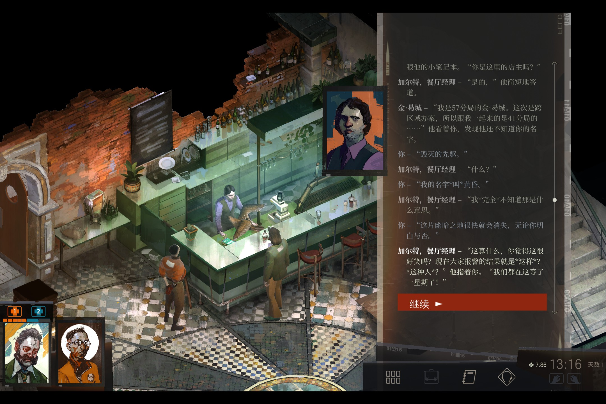
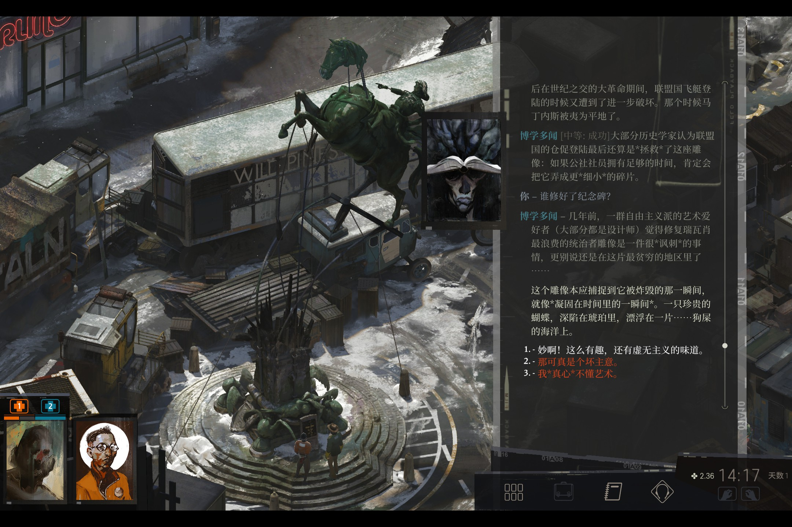
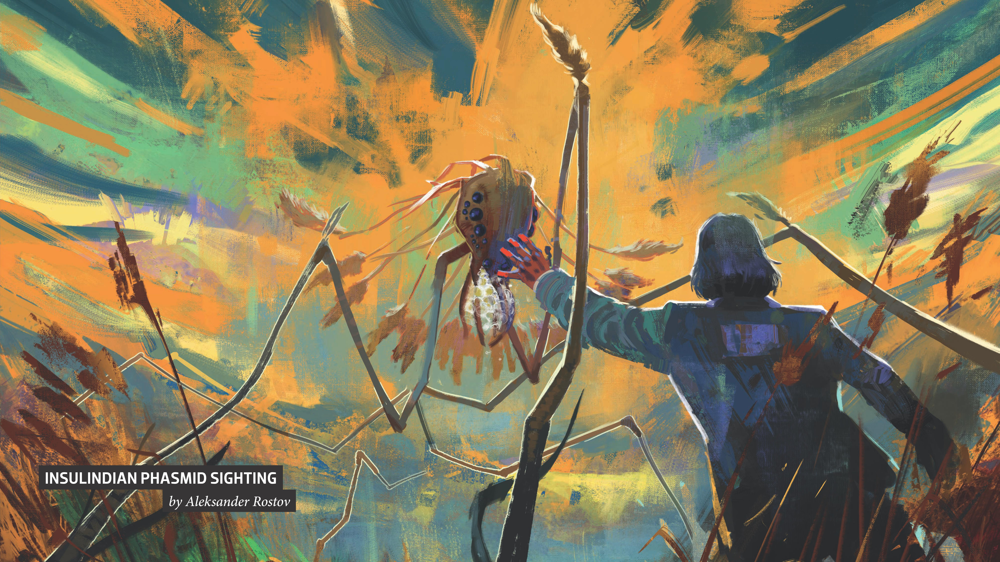
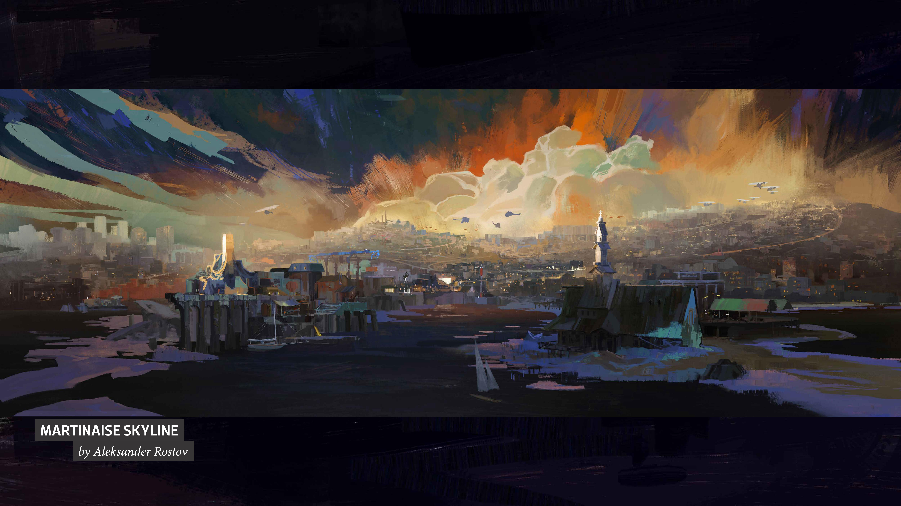

>《极乐迪斯科》就像是苏联寄出的最后一封信笺，通过科幻元素和游戏视角诉描绘了这样一幅画面——它告诉你说，放弃吧，屈服吧。我们没有丝毫不安与犹疑——《极乐迪斯科》就是一款生于磨难与失落的黑暗冒险。然而，细碎夹缝间偶有一丝光亮，残垣断壁处尚存几分友谊，唏嘘慨叹中不乏黑色幽默。 
> —— ZA/UM

<strong>提醒：内含剧透。</strong>

---

醒来是在一片黑暗中，一种不存在的状态。

故弄玄虚的古老爬虫脑声音低沉：宁静的时间流逝、旧日之爱、肉球般臃肿不体面的思绪、无可挽回，遭受了彻底打击的*你*从宿醉、狂欢、派对、空酒瓶与其他任何形式的极度混乱中赤裸裸地醒来，梦里残存的温软全都变成寒意涌上心头。你脸上不可遏制地留着超级巨星一般的表情，你体格健壮，却因烂醉如泥和嗑x而脆弱得像初生的婴儿。你什么都不记得了：你不记得自己的姓名与身份，不记得自己爱过谁，不记得你所有的搭档和要做的事情，不记得失忆之前的所有狂欢和所有荒芜。

你只剩下勉勉强强拼凑成的自己：荒唐幻想世界中横跨黑白两道的迪斯科警察、木房子一般的世界中的火焰喷射器、游走于法律边缘的某类天王巨星、卡拉斯·马佐夫的追寻者、纪尧姆·列米利翁、某个自由主义者、龙舌兰日落和最后的康米主义者。
  

<i>——所以他们都很不满，很不满。</i>

你和搭档要去探索一个吊死了人的案子，踉踉跄跄走遍整个小小的城镇，捡起每一分零钱和自己破碎的思绪，一遍遍询问自己的身份，面前展开一个宏大却荒芜的世界，以及案件之下每个人隐秘的私心、自己纷乱揪心的旧日情事、整个马丁内斯的落寞历史和芜杂的鸟鸣、铃兰与芦苇背后的秘密。

你一次又一次失败，在失败中你展现出很多小气、笨拙、懦弱、荒诞、不可理喻，这些或许是喝了酒嗑了x的人性之失败，也可能只是一直被掩藏的人性本色。你被人嘲笑，你向小孩打去却自己摔在地上，你一次又一次崩溃，渴望陷入虚无黑暗但温暖的怀抱。*过去*，你对它感到茫然，也感到惶恐。
  

<i>骑马者纪念碑立在交通岛中央</i>

  

你想成为什么就可以成为什么。你有机会选择去往康米主义（communism）、法西斯主义、道德主义还是极端自由主义。你可以继续醉酒嗑x、可以泡女人、可以自毁、可以一心断案或者插手工会与大集团之间的利益之争、可以坐在椅子上静静思考虚无、可以漫长地和自己对话、可以听悲凉的鸟鸣。

你也可以去唱一首悲凉的歌，然后肆意舞蹈——直至达到某种神异的境界，你与瑞瓦肖的灵魂交谈，然后昏倒在地。不论如何，在这个虚无荒凉、注定失败的地方，你垂死挣扎，横冲直撞。

你所要探索的吊人案子也像是一个隐喻：你梦见被吊死的是自己，浮肿腐臭的尸体之上竟然是闪耀绚丽的迪斯科彩球的光斑。死去的是你的过去、现在与未来，也是极乐世界的过去、现在与未来——而极乐世界就是所有一切，灰域与洲，燃烧着狂怒着的真理，八千年的历史。

一直向前推理、奔走，直到最后：你终于破解了那个吊人的案子，城市的荣光和大革命的火焰归于一片废墟，所有理想主义都迎来命中注定的失败，世界无可挽回地归于虚无，你的爱情一步步失败，变成一个冰凉的吻。你通过南向高速公路，终将到达一切尚未发生的原点。声嘶力竭的坤诺。神话般的伊苏林迪竹节虫。在不知道什么时候到来的明天，太阳会再一次升起，爬虫脑和幻梦都消散，你会把竹节虫的故事讲给神秘动物学家。你会变老，在退休之后和金漫长地坐在秋千上看海，直到连金也厌烦了为止。

  

<i>伊苏林迪竹节虫</i>

这个游戏构建了一个宏大奇幻的架空世界，又或者只不过是一个爱沙尼亚破败城市的复刻。它讲述了一个醉酒失忆警察的探案故事，也讲述了一段旧时代与新时代交替的悲凉史实。伟人雕像被推翻又重新树立，再被子弹刺穿，伤痕累累地俯视破败的城市。海浪拍打、吞噬醉酒的渔民。海鸥盘旋低回发出寂寂的哀鸣。教堂神像破碎：生后的世界——死亡，死后的世界——又是新生；青年们无力地狂吼着“hard core”，在教堂里肆意狂舞。*没有语言，只是跳舞。*  

令人感动之处，大概其实是历史本身，以及对命中注定要坠毁的命运消极的或伟大的、永无止息的对抗。
 

---
 

<i>没有语言，只是跳舞</i>

搬运一段steam玩家 **MEGALOASUKA** 的游戏测评以作结：  
  

**MEGALOASUKA** - 对于未来的文学界而言，Disco Elysium*可能*将跻身于二十一世纪第二个十年中最伟大的文学作品行列，与《看不见的城市》《我的名字是红》《哈扎尔辞典》和《万有引力之虹》等等一系列大师作品齐名。对于CRPG而言，Disco Elysium的系统*彻底*地颠覆且革新了原有的RPG游戏机制，使用了经典的桌游机制，却通过扎实的写作功力，创造了多种“自洽式”的行为模式，将人类社会中的思潮与观点浓缩于文本之间，让这个世界成为了一个真正鲜活的有机体。对于我个人而言，这*就是*2019年的GOTY。

**循循善诱** _[容易：成功]_ - 事实上，如果你具有能够正常地进行文学批评的知识储备和阅读量，对于社科有基本的认知，且持左翼政治立场，甚至对先验主义和超自然主义感兴趣，喜欢阿尔普、米罗、艾伦斯待、达利、马格里特、夏卡尔等的绘画的话，Disco Elysium会带给你更多*其他游戏无法替代*的价值。这部分价值对于确立*你自己*的价值观和哲学基本思辨有着决定性的意义。
  
**标新立异** _[极难：失败]_ - 还有齐泽克，你看看补HP用的药都是鼻通灵。

**MEGALOASUKA** - Disco Elysium的生动描述，使得任何一个对*文化*敏感的，善于阅读的人都可以从中找出自己的韵味来。游戏本身并不吝啬于表达创作者本身的观点，但对于玩家而言，其操纵的角色就如同第一个支线的墙壁一样，杂乱却如同白纸一般，需要玩家自己动手涂满颜色，成为完整的人，直面玩家“自己”痛苦不堪又令人怀念的真实。
  
**从容自若** _[极难：成功]_ - ZA/UM最令人敬佩的地方，在于其勇敢地表达出了自己共产主义（“康米主义”=Communism）的思想，在公开的、无耻的、直接的、露骨的资产阶级剥削和个人自由主义横行的当下，向主流文化挥动红色的大旗。并且他们夺取了高地，获得了尊敬，得到了胜利。ZA/UM将“电子游戏”这一消费主义产物作为载体，擦亮了辩证唯物主义的武器。在今天，他们就是最勇敢的人。
  
**同舟共济** _[极难：成功]_ - 在中文版更新通告中，ZA/UM更是直接表达了对于中国这一可能是最后传承了马克思主义火种的国家的期许和警告 -
  
_“我们读着苏联时代的科幻作品长大，憧憬着未来的新生活，然后亲眼目睹了整个联邦分崩离析。”_

_“这个大都会经历了不同阶段的洗礼，从王室倒台，到革命失败。而现在，这里被所谓的国外自由市场联盟控制。民众在贫穷中艰难求生，在形态各异的政治观点碰撞中迷失自我。这里绝非乐土，但我们却再也熟悉不过。”_

东欧人民在后苏联时代的迷茫和分崩离析，在Disco Elysium中深刻展现，一览无余。在这封“苏联寄出的最后一封信笺”里，中国人应当看出对未来反社会主义渗透的警告 - 事实上，这样的事情正在发生。- 这也正是Disco Elysium中文化的成功将会给我们带来巨大启示的原因。
 
**MEGALOASUKA** - GOTY颁奖时，ZA/UM说，“我们感谢所有伟大先哲带给我们的影响：伊利亚·列宾、弗拉基米尔·马科夫斯基、维克多·崔，以及马克思和恩格斯在政治理念上的启迪。” Disco Elysium正是这样一个站在先哲的肩膀上的伟大作品，使得其必将被未来世界的历史所铭记。

将严肃内容与哲学思考娱乐化是消解反抗和自省的最好办法，在“极乐的迪斯科”时代之下，我们更应当感谢这个ZA/UM和轻语工作室带给我们的东西。它就是砸在游戏里大吵大闹的毛孩子身上的一记重拳——你有54%的可能会自己摔倒，士气大减，但你仍要用46%的概率挥出重拳。

**平心定气** _[挑战：成功]_ - 这很难做到，但是我们一定会做到。

---

<strong>“欢迎来到瑞瓦肖”</strong>

<i>
But I got you, you got me. Got a chance, I believe. 

Love will come and break the spell tonight.
</i>

