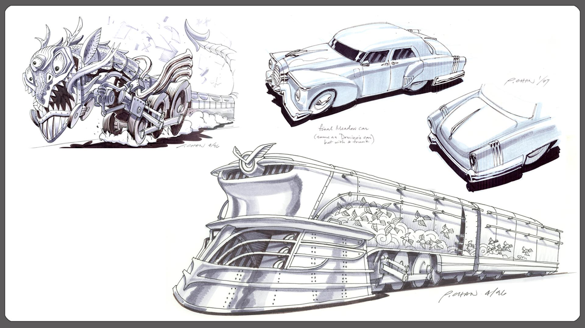
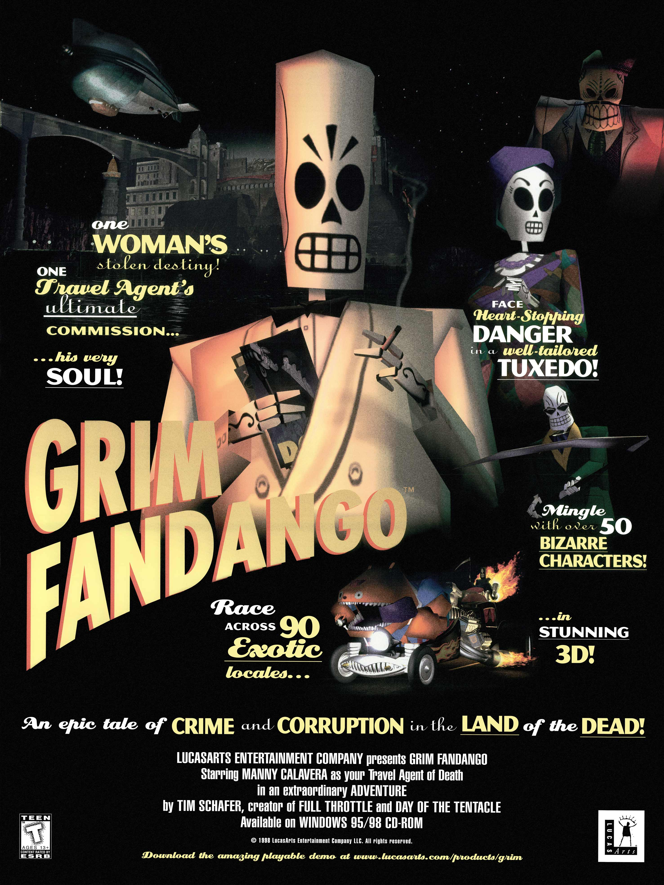
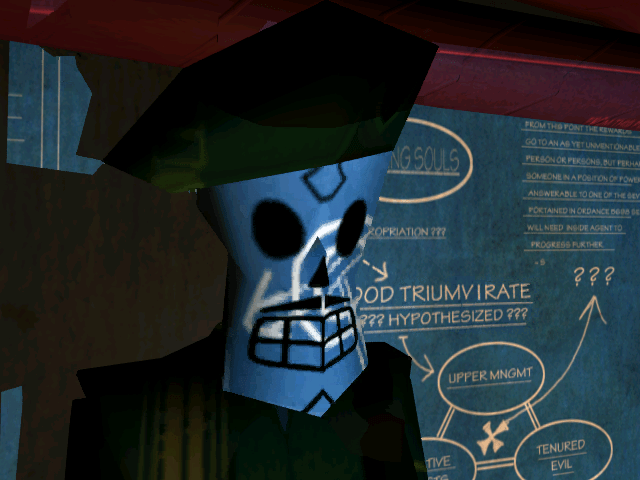
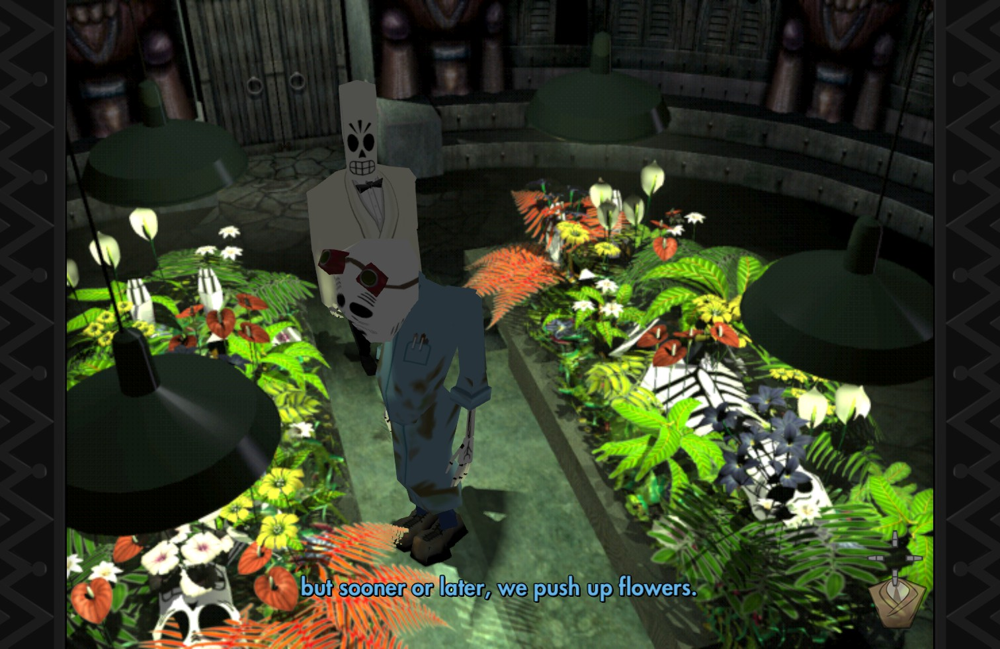
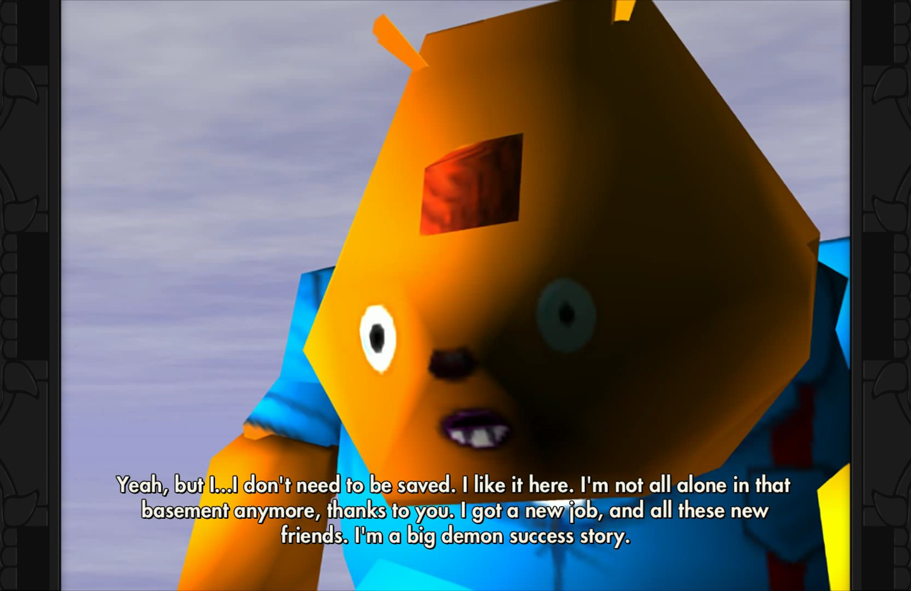


注意：以下文本可能包含剧透内容。


>With bony hands I hold my partner /
>On soulless feet we cross the floor /
>The music stops as if to answer /
>An empty knocking at the door /
>It seems his skin was sweet as mango /
>When last I held him to my breast /
>But now we dance this grim fandango /
>And will four years before we rest.

几天前和w闲聊，聊起文学作品的电影改编，比如莎士比亚和简·奥斯汀。她说以后或许可以写一篇叫Born adapted的论文（效仿Born translated），研究作者在创作作品的时候是否已经有意识使作品更适合被影视化，或者也可以联系电影史研究写作的时候哪些作家受到了什么电影的影响。那几天我恰好刚开始玩[《冥界狂想曲（重制版）》（Grim Fandango Remastered）](https://grimfandango.network/)，于是不假思索地回复她说感觉那样会有点不太好写，因为更常见的影响链或许应该是 `文学 -> 电影 -> 电子游戏`，特别是在题材和一些具体表现形式上，例如叙事视角与场景转换，尽管每个具体作品创作时受到的影响肯定是更错综复杂的。在之后的几天里，每当启动这个游戏，我就总开始赞叹于这部游戏独特的风格和浓郁的电影感，而上一部让我感觉特别有电影感的游戏还是深受黑泽明电影影响的《黄泉之路》（Trek to Yomi）。

## 一、在传统冒险游戏与互动电影之间

>I'm gonna let it shine, let it shine, let it shine, let it shine!

从第一幕cutscene开始，Grim Fandango就已经通过电影般的镜头语言向人展现出自身超越一般AVG的、作为互动电影的巨大魅力——利用连续几个瞄准死神走近着的影子的分镜，即将被玩家操控的主角Manuel Calavera（一般被叫做“Manny”，而[Calavera](https://en.wikipedia.org/wiki/Calavera)在西班牙语中其实正是头骨，常见于墨西哥亡灵节）身穿斗篷举着镰刀在阴影中露出脸，却用公事公办的销售语气对茫然的新来到Land of Dead的新鲜客户推销起将要进行的四年灵魂旅行的旅行套餐。简单几句话，不仅让不熟悉亡灵节文化背景的玩家大略了解了游戏背景，也奠定了整体的冷幽默与黑色基调。很快，玩家也将发现Manny看似高端的这份死神职业只不过类似于community service的还债工作，不仅会因为业绩被老板斥责，他的斗篷下脚底还偷偷踩了高跷以增加身高，手拿的镰刀竟然也是相当现代化的便携折叠款。至此，传统意义上的恐怖死神印象彻底被消解，正如（在我这个中国玩家看来）亡灵节也以其轻松和团聚的气息、鲜明的装饰、食物和鲜花一定程度上消解了人对于死亡的恐惧。

很快，借由不明原因的销售业绩严重下滑，Manny逐渐发现了上司Hector LeMans与同事Domino Hurley似乎有所密谋，并开始以个人的力量与之对抗，而第一步只是简单的——抢客户。玩弄小花招提前搞到客户信息、带着大块头的天真小弟一路飞车、接到品行无瑕理应得到高端Number Nine列车旅行资格的美女优质客户、发现随之而来的重大阴谋并决心寻求某种公正，Grim Fandango在开始就迅速集齐了黑色电影的绝大多数必备元素（由于在题材上也涉及了资本主义、腐败、工会与革命，因此也有点红色），在叙事的内容与表现方式上都显得更加具有“电影感”。不仅如此，[LucasArts](https://www.lucasfilm.com/what-we-do/games/)也为Grim Fandango配备了高水平的[Soundtrack](https://www.youtube.com/watch?v=km6bLtiSSq4)和细节丰富的高质量配音，给玩家提供了良好的沉浸感。

虽然在形式和题材上Grim Fandango都相当“电影化”，它仍然逃不开作为冒险游戏的本质，而它在冒险和谜题设计上多少有些争议，原因相当简单：有些解谜方式设置得有点太离谱，不少情况如果不看指南玩家很难猜到正确的方式（具体还是不剧透了）。不过本来就是架空世界观的有点幽默风格的游戏，其实想想解谜比较离谱倒也可以理解。操作上也有点抽象，甚至专门有个成就名叫“The Right Way -- Play the whole game with tank controls. Tim demanded this achievement.” 虽然实际上可以在设置里开启tank controls然后之后正常使用鼠标点击游玩游戏，但总之就是这些时刻（外加一些少量的bug）让你意识到它已经真的是一款超级老的游戏（比我还大几岁）了，对它的这些时代原因导致的缺点要宽容一点点，对它整体的跨越年代的震撼体验要额外赞扬。

抛开略微有点折磨人但也很有趣的谜题设计，Grim Fandango在叙事上其实相当优秀，以电影的节奏在起承转合之间讲好了一个关于死亡与新生、腐败与革命、爱与恨的故事，而多数谜题其实都严格地为剧情服务，只是有点脑洞大开。除此之外，游戏中也有相当多鲜活立体的出场角色，比如主角的好朋友，不需要被任何人拯救的Glottis；比如在海底一直绕圈走的唱着歌一路步行抵达终点的Chepito；比如在临终时刻还在绝望地寻找爱（“_Tell me Manny, would I have had a chance?_”）的Lola。每个人都以独特的属于他们自己的方式走向了最后的终点。

## 二、想象性的共产主义死神镰刀

>¡Viva La Revolución!


本小节参考了来源：[Material vs. Immaterial: Communism in Grim Fandango](https://www.youtube.com/watch?v=A-WqGzwaPW4)


尽管相关方面的讨论似乎不多，但是与常见的犯罪侦探或英雄救美题材的黑色电影不同，Grim Fandango的主线剧情是相当明确和明显的早期社会主义革命剧情：发现并对抗权力资本腐败、参加地下革命组织（在游戏中组织名叫Lost Souls' Alliance，其首领Salvador Limones感觉长得有点像切·格瓦拉……）、夺回被剥夺的普通人的车票（权利）、夺回被掌权者占据和蒙骗的（无辜而美丽的）女性、带领普通人坐上属于他们的列车以通向灵魂最后的终点。在这个亡灵社会缩影中，即使最初的设定是根据死者生前的品行来评估并通往终点，一种传统观念里期冀的因果报应，但在Manny上司的操控下死者仍然被阶级和财富分层，这也是剧情的核心矛盾。尽管其中也包含“英雄救美”的传统要素，但游戏中Manny对Meche几乎并没有太多情感的表达，只是反复强调是自己的错导致Meche无法正常坐上通往终点的、她生前品行良好的生活使她应得的豪华列车，**他的等待和寻找都更多是为了自我赎罪，而不是追求感情。**

这样的剧情设计和意识形态的影响在游戏中的女性角色形象中体现得相当明显：作为剧情中的女主角之一和被Mario追寻拯救的Princess Peach，Meche也完美符合一般的革命文学的被拯救女性的特征：纯洁而品行端正、作为死人显然也没办法有太多与原生家庭的纠葛、在完全无辜的情况下被权力资本夺走了属于自己的车票和命运，在被蒙骗和重新认清事实后，她无缝衔接地加入了为地下组织服务的阵容中；扮演上司的秘书但其实一开始就成为地下党的接线员Eva则是“妇女能顶半边天”类形象的案例，她拒绝了所有性缘关系，以完全投身于革命事业；聪明却善妒的、容易爱上错误的男人的Lola尽管贡献了关键的一张照片，却仍然难逃灭亡的命运；周旋在几个资本家和革命组织领袖之间的Olivia则是一款经典的“蛇蝎女人”形象，一个自由派机会主义者，人们不可抵挡地被她魅惑然后背叛，但自身最后也总要迎来某个机械降神的悲惨结局。

不过值得注意的另一点是，Olivia同时也是一家小酒吧The Blue Casket的Owner，平时向顾客售卖的呃呃其实是脏水（这次是真·刷锅水），而里面的顾客也只是一群虚伪的、空谈的、伪装的社会主义者，会给念同一首诗的不同人以极端差别的回应，会因为你是你而鄙视你但因为你认识某个大人物而崇拜你。这里的社会主义只是作为aesthetics and niches而存在。在游戏中，玩家扮演的Manny也可以上台念诗，而游戏提供的念诗方式因为本身的对话点击形式而格外有趣——对于每一行诗，游戏随机提供给你一些破碎的诗意的片段，而玩家可以随便把他们组合起来就变成一首诗，多少有点对无病呻吟艺术作品的嘲讽感。不管是Olivia、她的顾客们还是酒吧里的诗，整体都显然代表着一种虚无主义的立场。另一个有趣的地方是，Olivia本人创作的诗句（也就是本文开篇引用的段落）“*But now we dance this grim fandango /And will four years before we rest.*”是整个游戏唯一一次对“Grim Fandango”的点题。

与空谈的顾客们相对，在The Blue Casket外不远处就有一群罢工的工蜂（不要太明显的比喻），他们是没有原始生产资料的生产者，在既有的体系下连工会费都无法缴纳。他们有愤怒但没有表达的话语系统，因此只需要给他们一本红色书籍就可以掀起变革。虽然玩家其实并不会知道工蜂引导的变革最终结果会是什么，但是游戏中最有趣的成就之一就是“ME, ME, ME-ME-ME!”，玩家需要操控Manny跟工蜂一起喊口号，如果喊得不齐还会被指责，简直特别幽默——在尚未争取到权力的时候对整齐和协调的强制性要求就已经出现了（截止写作，只有4.9%的玩家达成了此成就）。



不论如何，Grim Fandango并不是一款严肃地讨论相关题材的游戏，而只是以一种相对积极的态度把有共产主义色彩的思想融入到了主要剧情中，整体上仍然是黑色电影风格的。和其他很多架空世界观的作品一样，Grim Fandango里的共产主义也是想象性的。如果说游戏对于死神的可折叠镰刀意象的消解相当成功（玩家很快就只是把镰刀当作工具、当作武器，而容易忘记它收割灵魂的原始功能），那么对共产主义镰刀的刻画更经典而刻板，但多少带一点嘲讽意味。在这方面多少会有点让人想起来极乐迪斯科——它教你渴望改变世界、让你开始试图寻找某种方法，甚至游戏制作者本人的情感认同可能也更偏近于康米主义，但游戏里的自称康米主义者多数都是一些乱七八糟的人……是的，它也告诉你康米主义是注定失败的主义。

## 三、死亡，与再次死亡

>I was born free. Nobody GAVE me no ticket, so nobody can TAKE it away.

说到死亡，我最近经常会想起马尔克斯在《梦中的欢快葬礼和十二个异乡故事》里的那篇序，他将其解释为自己身份认同感的觉醒：

>有一天，我梦见参加自己的葬礼，走在一群朋友中间，大家穿着肃穆的黑衣，气氛却像过节般热烈。所有人都因为相聚而感到快乐。而我则比任何人都快乐，因为死亡给了我这个同拉丁美洲的朋友们欢聚一堂的好机会，他们都是我最老最亲同时也阔别最久的朋友。葬礼结束，人们开始散去，我想陪他们一同离开。但其中一个朋友的话却如当头棒喝，让我意识到，对我来说，节日已经结束。“你是唯一不能走的人。”他说。直到这时我才明白，死亡就是再也不能跟朋友们在一起。<cite>[^1]</cite>

[^1]: 加西亚·马尔克斯著；罗秀译. 梦中的欢快葬礼和十二个异乡故事[M]. 海口：南海出版公司, 2015.05.

这似乎是一种很经典的很拉丁美洲的想法（请忽略我口不择言的形容词），即死亡是关于记忆与遗忘的，死亡似乎不是肉体的死去，而是你要永远离开你亲近的人，直到有一天被他们遗忘。这很容易让人想起那句《寻梦环游记》里的经典台词“_Death is not the end of life_, _forgetting is._（死亡并非生命的终点，遗忘才是）”

而Grim Fandango用另一种方式讨论死亡与第二次的死亡。如前所述，游戏第一幕Manny就已经告诉顾客，他之所以做这份工作是要“还债”，但用更好听的方式也可以说成是“自我救赎”。在遇见Meche并无意间揭开一场巨大的骗局之后，他不再仅限于自我救赎，而开始试图挽救其他无辜的普通人，要帮这些人最终可以抵达终点。这里的终点到底是什么，终点之后又会是什么？Manny也没有答案。在结尾Meche困惑地问他“Are we going to be together?” 他对Meche说：“You know, sweetheart, if there's one thing I've learned, it's this: nobody knows what's gonna happen at the end of the line, so you might as well enjoy the trip.” 然后他们很烂俗而夸张地、却又实在是释然而快乐地拉上列车窗帘接吻，然后随着列车一起驶入未知。

不管有怎样的外壳，Grim Fandango仍然是一个关于死亡的故事，而这也是它的魅力的根本来源之一，因为人们永远会对死亡和阐释死亡的一千零一种方式无限好奇。在《寻梦环游记》中，万寿菊是亡灵世界里唯一有生命的植物，是引领亡者的花朵。而在Grim Fandango中，骷髅们躯体的死亡会伴随着花朵的产生，因此美丽的鲜花对他们来说却意味着痛苦的生命之毁灭、腐败和消亡。尽管每个人其实都已经死过一次，但第一次死时多数人都有点茫然，所以大概还要花四年时间来适应、来自我救赎、来最终解脱。而不管是作为亡者的引领还是亡者再一次消亡的产物，鲜花总仍然意味着生命和生命力，因此骷髅身躯的死亡产生鲜花也其实意味着死亡带来新生。

因此，Grim Fandango不是那种惯常的关于死亡与遗忘的故事，你的第二次死亡并不一定是所爱之人的遗忘，而是关于你与自己的和解：关于如何自我救赎、如何现实地面对死亡——你的躯体会切切实实地被分解，成为土壤成为空气成为花朵，或者成为别的我们尚且不知道的某种事物——但在此之前，你尚且仍有机会做点什么。

