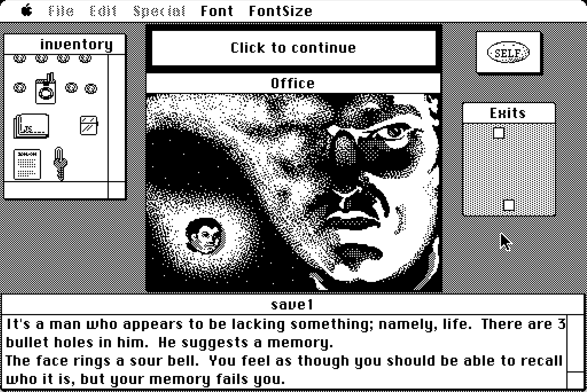
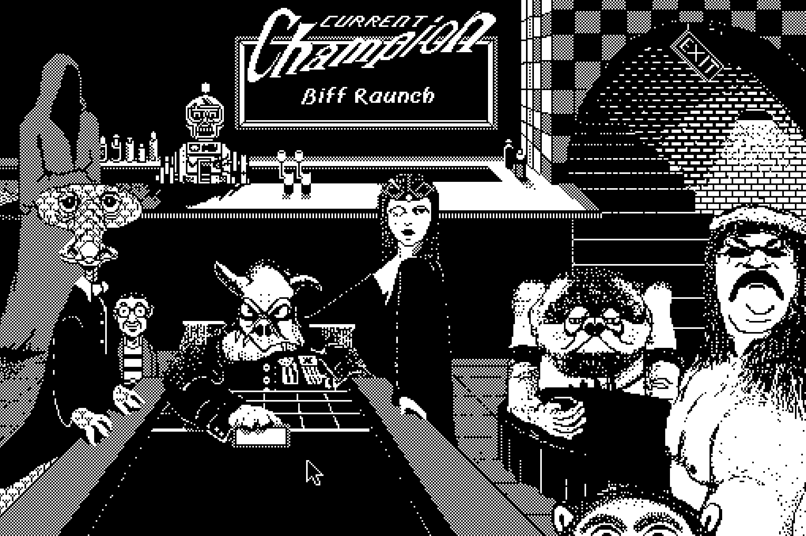
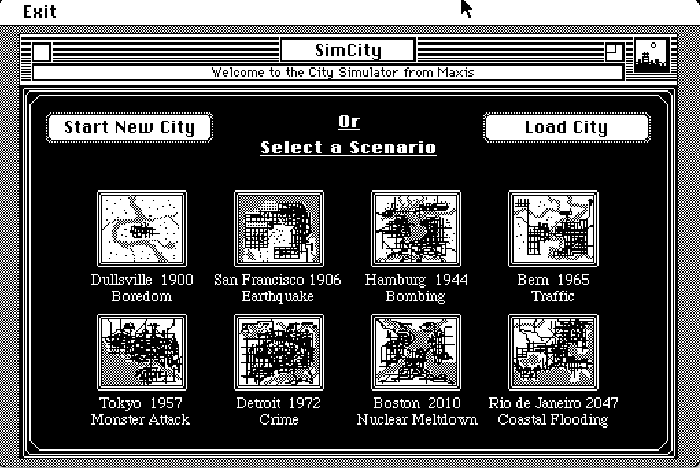
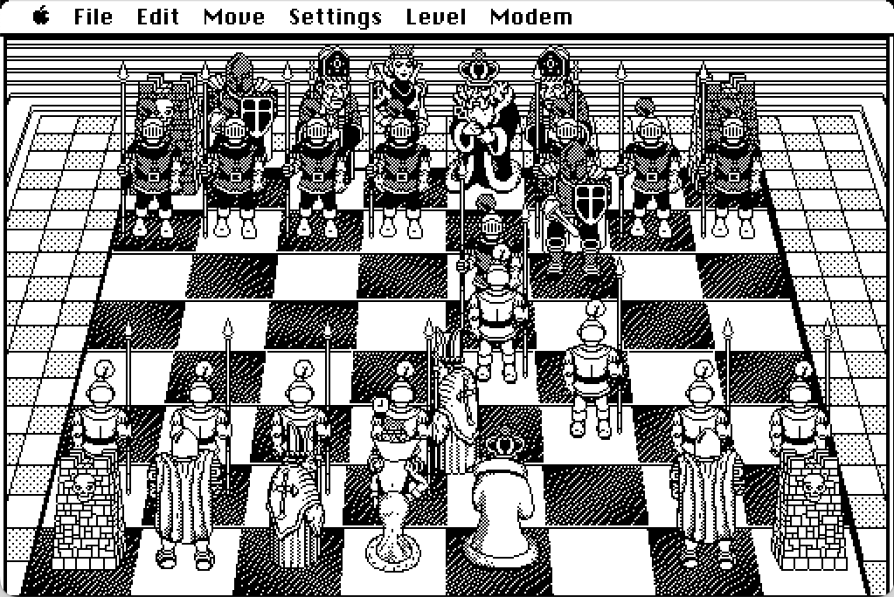
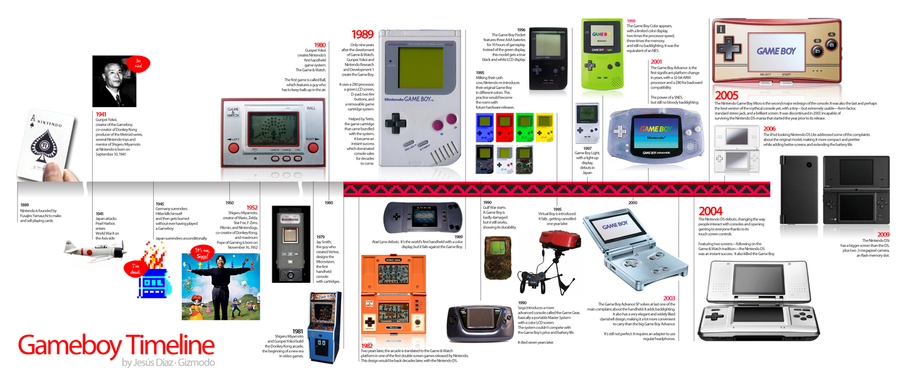
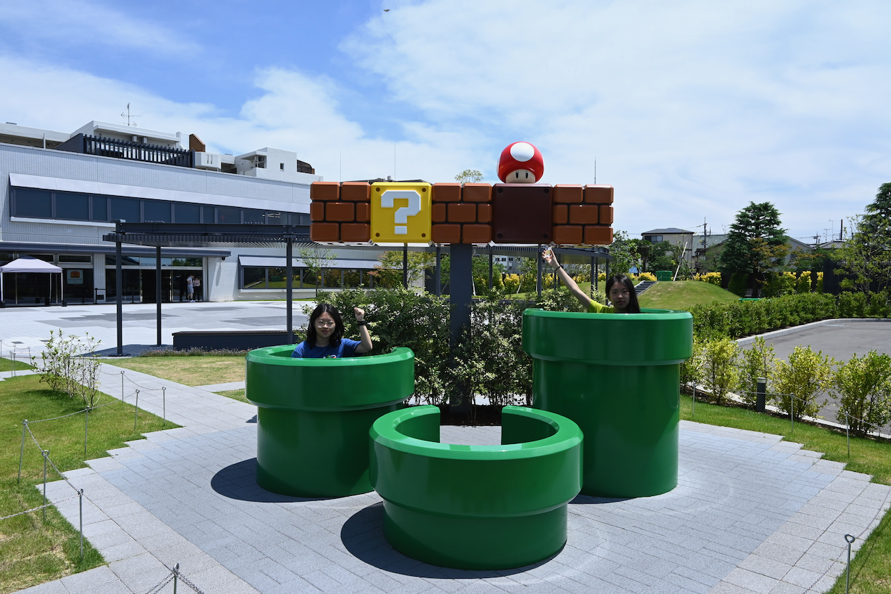
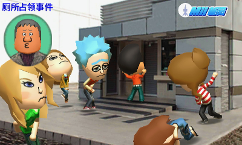

---
tags:
  - video_game
title: A Guide to Retro Gaming
created: 2026-04-13
bilingual: true
---

::: en
When I talk about "retro games," I usually mean both modern games made in a retro style and genuinely old games (e.g. from the 90s or earlier). But in this post, it refers to the latter. However, this post isn't really about retro gaming history -- it's about a practical question: as a player, how do you actually get your hands on those good old games?

There are pragmatic reasons to seek them out: most are small in size, run on low-spec hardware, and cost little or nothing (since many are only playable via emulator). But the more compelling reason is the craft itself: rich worlds and clever design that remain astonishing to this day, and the occasional pleasant jolt of recognising, in some game you love right now, exactly where it came from.

The games industry changes at a relentless pace, and so do the ways games are made. As AI lowers the barriers to game development, I find myself worrying, as both a player and a gamedev enthusiast, that shovelware will only become more rampant. So now it feels like a good moment to look back at games that were built with genuine care -- and to find in them something worth carrying forward.
:::

::: zh
我理解的“复古电子游戏”，既包括制作于近几年的复古风格的游戏，也包括发行于90s乃至更早的真正的老游戏。之所以对这些游戏感兴趣以至于想额外找时间游玩，不仅因为多数老游戏体积较小（低配电脑也能运行），价格低廉或无需购买（因为可能只能通过模拟器玩），还因为很多老游戏构建的丰富世界和巧妙的设计时至今日仍令人赞叹，并且有时候还能惊喜地发现你现在钟爱的一款现代游戏的灵感来源。

游戏行业日新月异地变化着，游戏的生产方式也正在不断变化。不仅如此，随着AI技术的发展，游戏制作的门槛在逐渐降低，作为游戏玩家和gamedev爱好者，我不禁担心粗制滥造品更加横行。在这种时刻，回顾早年开发者手工制作和优化的游戏或许会给人新的启迪。

不过这篇文章暂且不多谈复古游戏历史，而是更关注有哪些方法和渠道可以让现代的玩家玩到以前的那些好游戏。
:::

---

::: en
## Retro Gaming Resources

If you just want a quick taste, the simplest option is to play directly in your browser on one of these sites:

- [RetroGames.cz](https://www.retrogames.cz/index.php)
- [ClassicReload.com](https://classicreload.com/)
- [Classic Macintosh Game Demos](https://classicmacdemos.com/)

That said, most players who are slightly more serious will prefer playing locally, because you can save your progress at any time, play offline, and generally get better input response. Here are some places to download games:

- [My Abandonware – Download Old Video Games](https://www.myabandonware.com/)
- [Mac Source Ports: Games for Apple Silicon and Intel Macs](https://www.macsourceports.com/)
- [bobeff/open-source-games: A list of open source games](https://github.com/bobeff/open-source-games)

For games that no longer have any official purchase channel and no pre-compiled port available, you'll need to download ROMs and use emulators. Here are some useful links:

- Download game ROMs: [Emulator Games](https://www.emulatorgamesx.net/)
- Starter guides for many devices: [Retro Game Corps](https://retrogamecorps.com/)

### Emulators (that I've used)

| Emulator | Platform | Notes |
| --- | --- | --- |
| [RetroArch](https://www.retroarch.com/) | Windows, Linux, macOS, iOS, Android, and more | A comprehensive emulator |
| [OpenEmu](https://openemu.org/) | macOS | Emulates a huge range of consoles |
| [DOSBox-X](https://dosbox-x.com/) | Windows, Linux, macOS, and DOS | DOS emulator |
| [Boxer](http://boxerapp.com/) | macOS | DOS game emulator |
| [ScummVM](https://www.scummvm.org/) | Windows, Linux, macOS, iOS, Android, and more | Limited library, but actively developed |

#### A Note on macOS and Windows

I've long had a quiet grievance with the idea that Macs are "not for gaming." The display quality, the speakers, the performance, the battery life -- all of it should, at minimum, serve anyone whose tastes run to modern video games on it. But the unfortunate reality is that many games simply haven't been ported to macOS. For retro games, though, macOS fares reasonably well: quite a few of the emulators above support Mac, and there are dedicated resources like [Mac Source Ports](https://www.macsourceports.com/), plus tools like [Porting Kit](https://www.portingkit.com/) for converting certain GOG and Steam games into macOS-compatible formats.

On Windows, most retro games can be played directly or easily found in versions that other players have already converted. For anything else, [RetroArch](https://www.retroarch.com/) remains an excellent catch-all.

## GOG

[GOG.com](https://www.gog.com/en/) is, without question, the **best** platform today for the preservation and purchase of good old games (they even run a dedicated [GOG Preservation Program](https://www.gog.com/en/gog-preservation-program)). It carries many titles that never made it to Steam, and its greatest strength is that all games sold there are ==DRM-free==: you can play offline without having to log in every time, unlike Steam. 

That said, the same game can vary in subtle ways between the two platforms: GOG versions tend to have less achievement systems, for instance, so it's worth comparing prices, platform support, and review sections before buying. Tools like [GOG Database](https://www.gogdb.org/) and [SteamDB](https://steamdb.info/) are handy for this.

Compared to the Steam client, [GOG GALAXY](https://www.gog.com/galaxy) is more flexible in that it lets you browse and download your library across other platforms too. I actually find the open-source, free [Heroic Games Launcher](https://heroicgameslauncher.com/) more capable and easier to use. GOG Galaxy, for what it's worth, had a persistent bug on macOS where the app would refuse to quit properly. They only fixed in the relatively recent 2.0 update, which is rather hard to believe...
:::

::: zh
## Retro Gaming Resources

如果只是想浅尝辄止，那么最简单的方式是直接在诸如以下网站在线游玩：

- [RetroGames.cz](https://www.retrogames.cz/index.php)
- [ClassicReload.com](https://classicreload.com/)
- [Classic Macintosh Game Demos](https://classicmacdemos.com/)

不过略进阶一点的玩家多数还是会选择本地游玩，这样进度可以随时保存，也可以离线游玩，操作效果可能也会更好。以下是一些可以下载游戏的渠道：

- [My Abandonware - Download Old Video Games](https://www.myabandonware.com/)
- [Mac Source Ports: Games for Apple Silicon and Intel Macs](https://www.macsourceports.com/)
- [bobeff/open-source-games: A list of open source games.](https://github.com/bobeff/open-source-games)

对于已经没有正版购买渠道也没有已经编译好的port的游戏来说，这时候就需要下载ROM和各种模拟器了。以下是一些有用的链接：

- Download game ROM: [Emulator Games](https://www.emulatorgamesx.net/)
- Starter Guide for many devices: [Retro Game Corps](https://retrogamecorps.com/)

### Emulators (that I've used)

| Emulators                               | Platform                                      | Notes             |
| --------------------------------------- | --------------------------------------------- | ----------------- |
| [RetroArch](https://www.retroarch.com/) | Windows, Linux, macOS, iOS, Android, and more |                   |
| [OpenEmu](https://openemu.org/)         | macOS                                         | 可以模拟大量主机          |
| [DOSBox-X](https://dosbox-x.com/)       | Windows, Linux, macOS, and DOS                | DOS emulator      |
| [Boxer](http://boxerapp.com/)           | macOS                                         | DOS game emulator |
| [ScummVM](https://www.scummvm.org/)     | Windows, Linux, macOS, iOS, Android, and more | 游戏阵容不多，不过开发很积极    |

我一直对MacBook“不适合游戏”这件事耿耿于怀：屏幕、音响素质优秀、性能不错、续航超强，这些都本应该至少满足非3A游戏爱好者的需求。可惜很多游戏在macOS上出于种种原因未能进行适配。不过对于复古游戏来说，macOS的适配其实还算勉勉强强——除了前面提到的不少模拟器都支持mac以外，也有类似于[Mac Source Ports](https://www.macsourceports.com/)等游戏资源平台，也可以通过 Porting Kit自己转换GOG和Steam里面的部分游戏为macOS支持的格式。

Windows系统上（一如既往）狠毒老游戏都可以直接玩，或者很轻易就可以下载到已经被其他玩家转换好的版本。对于剩余的游戏， [RetroArch](https://www.retroarch.com/) 也是一个很好的选择。

## GOG

除了使用

[GOG.com](https://www.gog.com/en/) 无疑是当前最好的老游戏保护和购买平台（他们还有专门的 [GOG Preservation Program](https://www.gog.com/en/gog-preservation-program)），有很多steam上没有的good old games，而且最大优点是他们售卖的是==DRM-free==游戏，可以离线游玩而不必像steam一样每次登录。不过有些游戏在steam和GOG上的优化可能会略微不同，即使是同一个游戏，在GOG普遍会没有steam上那么完善的成就系统，一般购买游戏的时候还是要综合对比价格、支持、系统和评论区评价来选择（可以用[GOG Database](https://www.gogdb.org/) 和[SteamDB](https://steamdb.info/)）。

相比steam客户端，[GOG GALAXY](https://www.gog.com/galaxy)更灵活，提供其他平台游戏库存的陈列和下载，不过其实我觉得开源免费的[Heroic Games Launcher](https://heroicgameslauncher.com/)会更灵活和好用。GOG galaxy甚至长期一直有macOS无法正常退出的bug，直到最近的2.0版本才解决，令人难以置信。
:::

---

::: en
## Classic Macintosh Games

{width=60%}

Early macOS had no such reputation for being "bad for gaming." In fact, we can still experience many of those cool old Mac games today through Macintosh emulators (or real old Macs if you have one).

[Getting Started (WIP) – Macintosh Repository](https://www.macintoshrepository.org/articles/1-getting-started-wip-) is an excellent all-in-one introduction to the scene. My personal emulator of choice is [Mini vMac](https://www.gryphel.com/c/minivmac/index.html), simply because I adore the 2bit minimalism of Macintosh System 7. Once you're up and running, [Macintosh Garden](https://macintoshgarden.org/) is a nice place for classic Mac games and software.

My current favourite is [Déjà Vu](https://en.wikipedia.org/wiki/D%C3%A9j%C3%A0_Vu_(video_game)), which cleverly uses the Mac's ==native Finder interface== as part of the game itself -- there's something wonderfully meta about it. Other standouts from the same era include Shufflepuck Café, SimCity, Glider, and Battle Chess, each remarkable in its own way.
:::

::: zh
## Classic Macintosh Games

{width=60%}

不过早年的macOS可并没有“不适合游戏”的说法，现在我们还可以用 macintosh 模拟器体验到很多当年的mac游戏。

[Getting Started (WIP) - Macintosh Repository](https://www.macintoshrepository.org/articles/1-getting-started-wip-) 是一个特别好的综合介绍，我自己选择的模拟器是[Mini vMac](https://www.gryphel.com/c/minivmac/index.html)，因为最喜欢 Macintosh system7那种黑白的极简设计。下载安装好后，可以在[Macintosh Garden](https://macintoshgarden.org/)找到很多Macintosh游戏 and 软件。

我个人目前最喜欢的游戏是[Déjà Vu](https://en.wikipedia.org/wiki/D%C3%A9j%C3%A0_Vu_(video_game))，因为它很巧妙地使用了mac自带的文件管理系统来进行游戏，有一种很meta的感觉。同一时期的Shufflepuck Cafe、simcity、Glider、BattleChess也都各具特色，令人赞叹。
:::

  <figure>
    
    <figcaption>Déjà Vu</figcaption>
  </figure>
  <figure>
    
    <figcaption>Shufflepuck Café</figcaption>
  </figure>
  <figure>
    
    <figcaption>SimCity</figcaption>
  </figure>
  <figure>
    
    <figcaption>Battle Chess</figcaption>
  </figure>

---

## Nintendo

::: en
As one of the defining forces in the games industry, Nintendo was producing design strokes of near-genius very early on -- *Super Mario Bros.*, the *Legend of Zelda* series, and a series of inventive hardware. The best place to explore Nintendo's history is the [Nintendo Museum](https://museum.nintendo.com/en/index.html), and Nintendo's own website also has a overview at [Nintendo History | Hardware](https://www.nintendo.com/en-gb/Hardware/Nintendo-History/Nintendo-History-625945.html).
:::

::: zh
作为游戏行业的领先者，在游戏开发很早期，Nintendo就已经产出了很多设计上颇为天才的好游戏，例如《超级马力欧兄弟》《塞尔达传说》系列，以及同样富有创意的硬件。要了解任天堂的历史，最好的地方莫过于[Nintendo Museum](https://museum.nintendo.com/en/index.html)，他们自己官网也有历史介绍[Nintendo History | Hardware](https://www.nintendo.com/en-gb/Hardware/Nintendo-History/Nintendo-History-625945.html)。
:::

::: en
### Nintendo Switch

The simplest way to experience GBA and Famicom games in their most authentic form is through [Classic games – Nintendo Switch Online](https://www.nintendo.com/en-gb/Nintendo-Switch-Online/Classic-games/Classic-games-Nintendo-Switch-Online-2719182.html). With a Switch Online membership, you get access to a curated selection of games -- mostly in Japanese and English, but even just playing them leaves you in quiet admiration of the design. There's also an Expansion Pack for the more dedicated. 

For me, there's one particularly welcome feature: these games all support save states and rewind, so less experienced players can still experience as much of the game as possible.

### 3DS

Unfortunately, Nintendo Classics hasn't yet included 3DS titles (probably because the 3DS doesn't quite feel old enough to qualify). Your options are to use an emulator or to buy a second-hand 3DS. For emulator, [Azahar](https://github.com/azahar-emu/azahar) is the currently active one, though I haven't tried it personally; second-hand 3DS come in a range of models, though most are still priced somewhat higher than I'd hoped. After a long search on the second-hand market, I eventually found one -- the screen is slightly yellowed, battery life is poor, certain games trigger crash bugs, and SD card read speeds are painfully slow, but it **works** (and worth the price).
:::

::: zh
### Nintendo Switch

想要原汁原味地玩到GBA、FC等主机上的游戏，最简单的方法是通过[Classic games – Nintendo Switch Online](https://www.nintendo.com/en-gb/Nintendo-Switch-Online/Classic-games/Classic-games-Nintendo-Switch-Online-2719182.html)。只要有NS会员就可以玩到一系列精选游戏，虽然几乎都是日语英语为主，但玩起来还是深感设计精妙。如果是发烧友还可以购买expansion pack。一大优点是这些游戏都提供了随时存档和回溯功能，手残党也可以更方便地尽可能多体验到下一关的游戏内容。

### 3DS

不过较为可惜的是，目前Nintendo Classics没有把3DS游戏包含在内（可能因为3DS还不算特别老的主机），只能自己用模拟器或者直接购买二手机器。如果想下载3DS模拟器游玩，目前还在积极维护的是[azahar](https://github.com/azahar-emu/azahar)，不过我并没有尝试过。二手3DS有各种型号可以选择，不过截止目前多数机型的价格都有点过高。我之前在二手网站浏览许久淘得一台，虽然屏幕略微发黄，整体还是能够正常使用，为数不多的缺点是：续航较差、部分游戏会触发死机 bug、SD 卡读取速度超级慢。
:::

::: en
The 3DS [game library](https://www.nintendo.com/en-gb/Hardware/Nintendo-3DS-Family/Games/Games-116361.html) is super impressive, and many titles make wonderful use of it's unique hardware: dual screens (top and bottom), glasses-free 3D, a camera and microphone, a circle pad, a stylus. By today's standards the performance and fidelity are decidedly vintage, but put it all together and the experience still feels inventive and fresh. You'll find yourself marvelling repeatedly at the ingenuity of the people who designed both the games and the hardware. In my opinion, the 3DS is one platform where buying a physical unit rather than using an emulator really does feel like the right call.

#### Modding, Installing Games, and System Setup

OasisAkari's blog has an detailed walkthrough (in Chinese): [3DS Modding – Getting Started](https://stray-soul.com/3dshack-getstarted.html)

#### Download 3DS Games

- Chinese-translated releases:
  - [3DS Chinese Game List | Shi Pengliang's Blog](https://shipengliang.com/download/3ds/3ds-%e4%b8%ad%e6%96%87%e6%b8%b8%e6%88%8f%e5%88%97%e8%a1%a8.html)
  - [爱 3DS](https://i3ds.fun)
  - [3DS Full Chinese Game Collection CIA (Official + Fan Translations) (275 titles) – Switch520](https://www.gamer520.com/13110.html)
- English releases:
  - [hShop](https://hshop.erista.me/)
  - [3DS ROM & CIA – 3DS Decrypted Game Download](https://romsfun.com/roms/nintendo-3ds)
:::

::: zh
3DS 上的[游戏阵容](https://www.nintendo.com/en-gb/Hardware/Nintendo-3DS-Family/Games/Games-116361.html)相当豪华，而且很多游戏都对其硬件有良好的适配，乃至可以利用各种独特的硬件特性进行游戏——上下双屏、裸眼 3D、摄像头+麦克风、圆环摇杆和触控笔……尽管现在来看性能和效果只能说是复古，但组合起来依旧给人新颖的游戏体验，边玩边反复赞叹当年游戏开发和硬件设计者的天才。从这个角度来说相比其他主机，3DS真的很适合购买实体机器游玩而不是用模拟器。

#### 破解、安装游戏、系统

OasisAkari 在其blog里有特别详细的介绍，可以直接参考：[3DS破解-开始 | 一只火狐的杂物间](https://stray-soul.com/3dshack-getstarted.html)

#### Download 3DS Games

- Chinese translated:
	- [3DS 中文游戏列表 | 时鹏亮的Blog](https://shipengliang.com/download/3ds/3ds-%e4%b8%ad%e6%96%87%e6%b8%b8%e6%88%8f%e5%88%97%e8%a1%a8.html)
	- [爱3DS](https://i3ds.fun)
	- [3DS中文游戏全集CIA(官中+汉化)(275个)-Switch520](https://www.gamer520.com/13110.html)
- English
	- [hShop](https://hshop.erista.me/)
	- [3DS ROM & CIA - 3DS Decrypted Game Download](https://romsfun.com/roms/nintendo-3ds)
:::

### Game & Watch

::: en
Somewhat less well-known, Game & Watch was a series of handheld devices Nintendo produced in the 1980s and 90s, as part digital clock, part simple game machine. One could reasonably call them a distant ancestor of the [Nintendo Sound Clock Alarmo™](https://www.nintendo.com/us/store/products/nintendo-sound-clock-alarmo-121311/). In 2020, Nintendo released two limited-edition products: [Game & Watch: Super Mario Bros.](https://www.nintendo.com/hk/hardware/gamewatch/) and [Game & Watch: The Legend of Zelda](https://www.nintendo.com/hk/hardware/gamewatch/zelda/index.html), each containing a functional clock, the original Game & Watch minigames, and ports of several Famicom and Game Boy Mario and Zelda titles. Charming things.

Play online:

- [RetroFab by Itizso](https://itizso.itch.io/retrofab)
- [lcdgame.js – LCD game simulators](http://bdrgames.nl/lcdgames/)

There are also many fan-made HTML Game & Watch games on itch.io and similar platforms, such as [Cuphead: Game And Watch Edition](https://dedjo0.itch.io/cuphead-game-and-watch-edition) and [LCD, Please](https://dukope.itch.io/lcd-please) (the latter is made by Lucas Pope, one of my favourite indie game developers).
:::

::: zh
相对没有那么有名的，Game & Watch 是任天堂上世纪八九十年代推出的一系列掌上硬件，既可以作为普通的电子时钟，也可以游玩一些简单的游戏，想来也可以算是[Nintendo Sound Clock Alarmo™](https://www.nintendo.com/us/store/products/nintendo-sound-clock-alarmo-121311/)的祖辈。在2020年，任天堂推出了两款限定产品：[Game & Watch: 超級瑪利歐兄弟｜任天堂](https://www.nintendo.com/hk/hardware/gamewatch/)和[Game & Watch 薩爾達傳說｜任天堂](https://www.nintendo.com/hk/hardware/gamewatch/zelda/index.html)，不仅包含了可以玩的时钟、game & watch小游戏，还把Famicom和gameboy版本的几个马力欧和塞尔达游戏移植了进来，算是很有意思的产品。

在线游玩：

- [RetroFab by Itizso](https://itizso.itch.io/retrofab)
- [lcdgame.js - LCD game simulators](http://bdrgames.nl/lcdgames/)

如果感兴趣，也可以在itch.io等平台上玩到很多HTML版本的粉丝制作的game and watch游戏，例如 [Cuphead: Game And Watch Edition](https://dedjo0.itch.io/cuphead-game-and-watch-edition)。
:::

---

## Conclusion

Looking back, writing this post turned out to be its own kind of rabbit hole. Somewhere in the middle of organising these resources, I ended up replaying a few rounds of Simcity on Mini vMac.

I also realised there's a particular quality I love about the retro gaming community: players who carefully document everything about a game on wikis and forums -- modding guides, fan translations, hardware compatibility lists -- not for any obvious reason, but simply because they don't want those things to disappear, and help others to enjoy them. That instinct feels as worth preserving as the games themselves.

So perhaps this is less a guide than an invitation. If some half-remembered game from childhood suddenly comes back to you on a random weekend -- this is a place to start looking for it ;)
