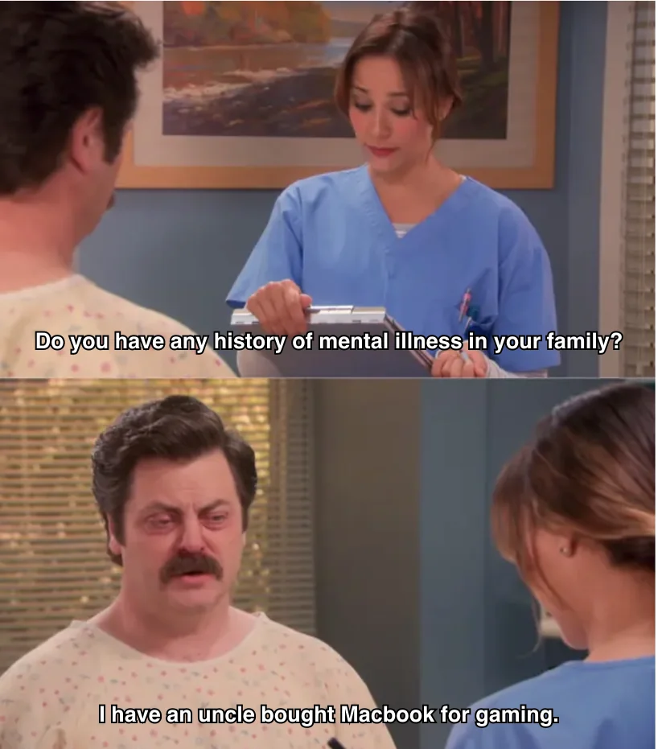
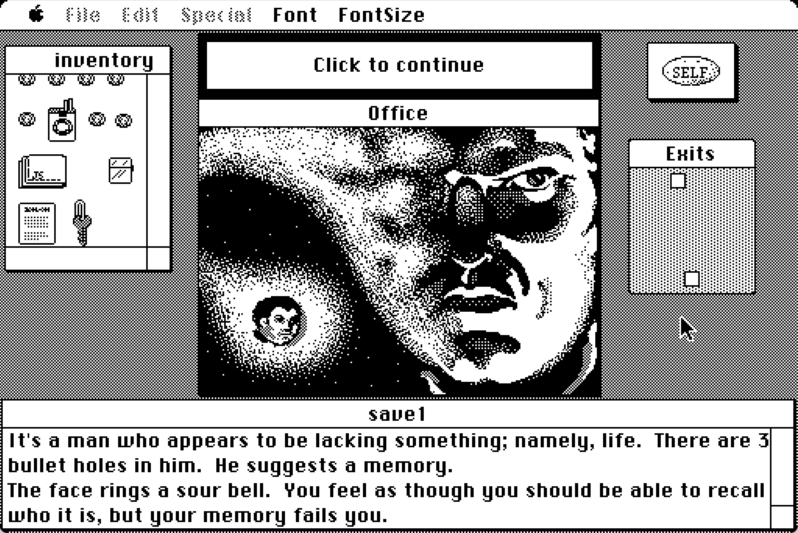
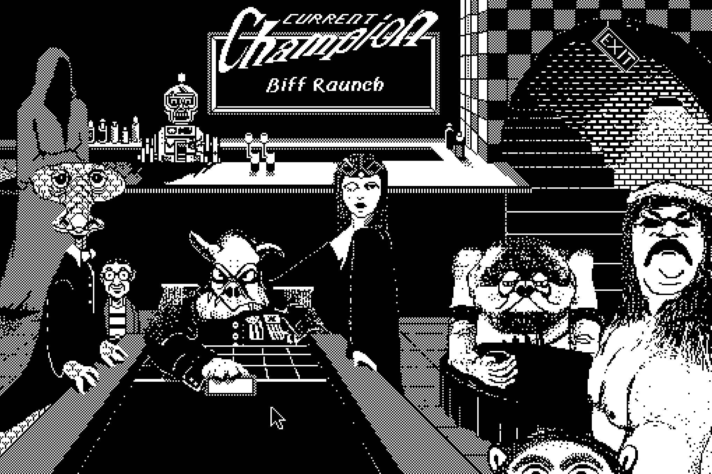
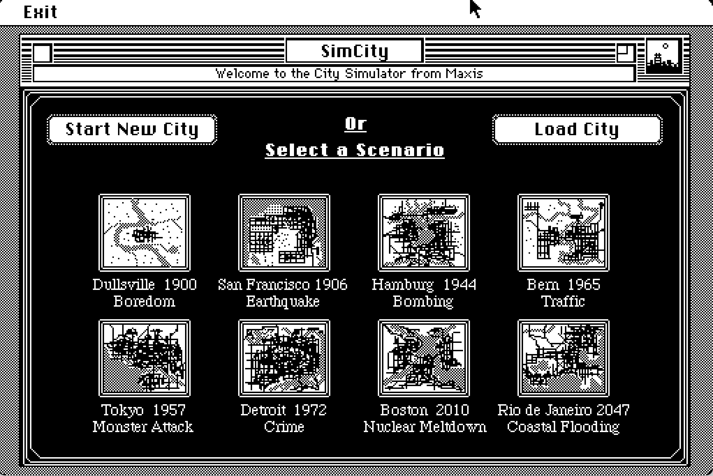
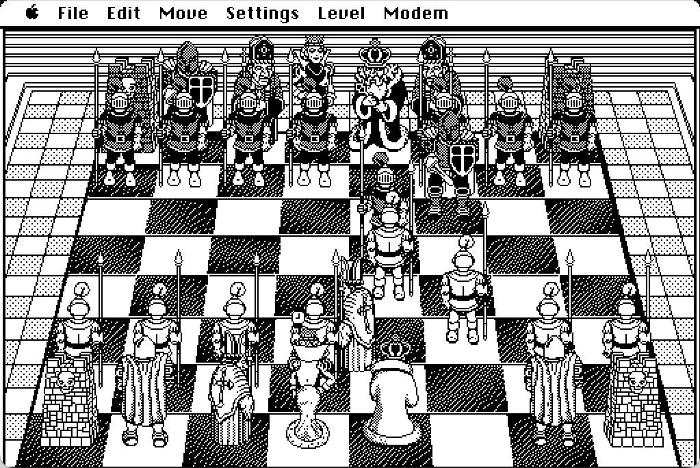
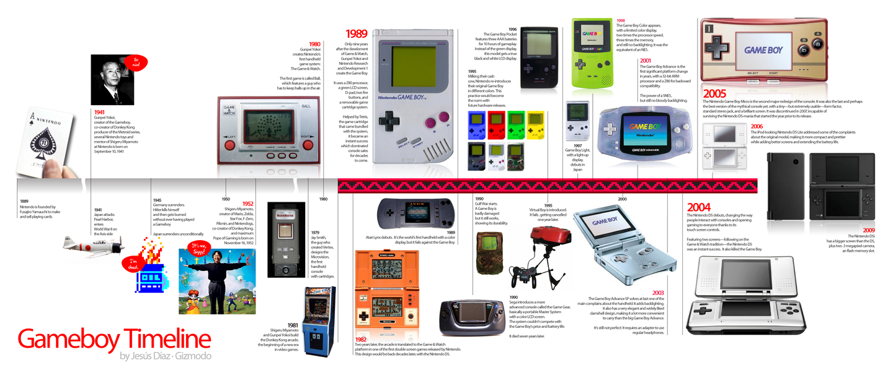
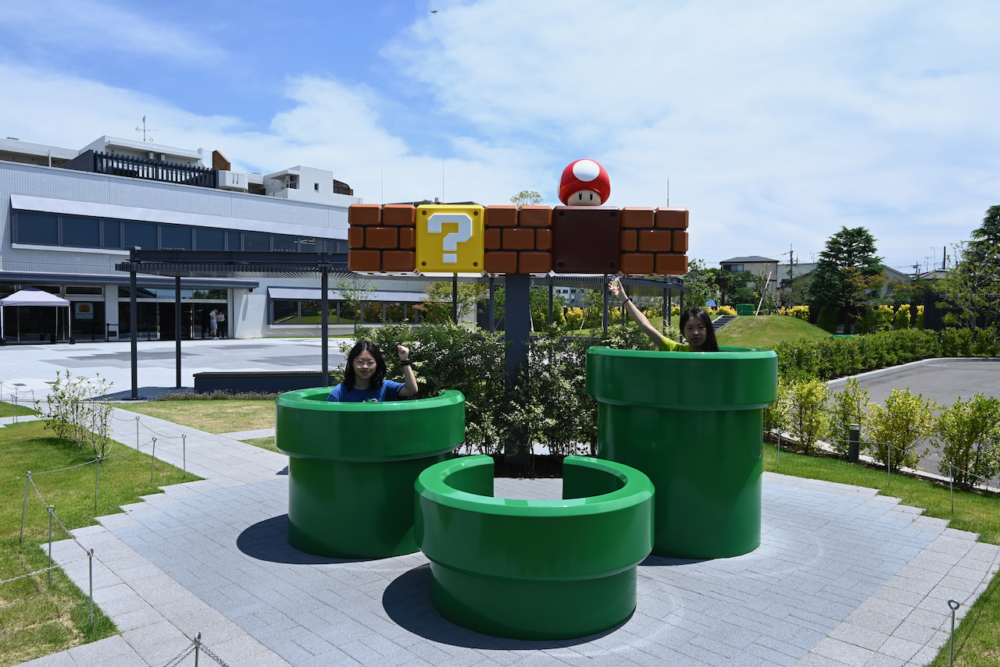

我理解的“复古电子游戏”，既包括制作于近几年的复古风格的游戏，也包括发行于90s乃至更早的真正的老游戏。之所以对这些游戏感兴趣以至于想额外找时间游玩，不仅因为多数老游戏体积较小（低配电脑也能运行），价格低廉或无需购买（因为可能只能通过模拟器玩），还因为很多老游戏构建的丰富世界和巧妙的设计时至今日仍令人赞叹，并且有时候还能惊喜地发现你现在钟爱的一款现代游戏的灵感来源。

游戏行业日新月异地变化着，游戏的生产方式也正在不断变化。不仅如此，随着AI技术的发展，游戏制作的门槛在逐渐降低，作为游戏玩家和游戏开发者，我不禁担心粗制滥造品更加横行，越来越难玩到有细节有巧思的好作品。在这种时刻，回顾早年开发者手工制作和优化的游戏或许会给人新的启迪。

不过这篇文章暂且不多谈复古游戏历史，而是更关注有哪些方法和渠道可以让现在的玩家玩到以前的那些好游戏。

---

## Retro Gaming Resources

如果只是想浅尝辄止，那么最简单的方式是直接在例如以下的网站在线游玩：

-  [RetroGames.cz](https://www.retrogames.cz/index.php)
- [ClassicReload.com](https://classicreload.com/)
- [Classic Macintosh Game Demos](https://classicmacdemos.com/)

不过，略进阶一点的玩家多数还是会选择本地游玩，因为这样进度可以随时保存，还可以离线游玩，操作效果可能也会更好（比如可以修改键位或者绑定控制器）。以下是部分可以下载游戏的渠道：

- [My Abandonware - Download Old Video Games](https://www.myabandonware.com/)
- [bobeff/open-source-games: A list of open source games.](https://github.com/bobeff/open-source-games)
- [Mac Source Ports: Games for Apple Silicon and Intel Macs](https://www.macsourceports.com/)

注意这些页面提供的游戏基本上是已经被开发者开源或者废弃的游戏。已经有更多游戏都被盗版和在线提供，但是本文尽量不对此评价和推荐。

## GOG

对于想要下载到本地来游玩的玩家来说，[GOG.com](https://www.gog.com/en/) 无疑是当前最好的老游戏保护和购买平台（他们还有专门的 [GOG Preservation Program](https://www.gog.com/en/gog-preservation-program)），也是最方便的合法游玩老游戏的方式。他们不仅有很多steam上没有的good old games，而且最大优点是他们售卖的是 ==DRM-free== 游戏，可以离线游玩而不必像steam一样每次登录。不过有些游戏在steam和GOG上的优化可能会略微不同，即使是同一个游戏，在GOG普遍会没有steam上那么完善的成就系统，可能版本更新也会较迟，一般购买游戏的时候还是要综合对比价格、支持、系统和评论区评价来选择（可以用[GOG Database](https://www.gogdb.org/) 和[SteamDB](https://steamdb.info/)）。

相比steam客户端，[GOG GALAXY](https://www.gog.com/galaxy)更灵活，提供其他平台游戏库存的陈列和下载。不过其实我觉得开源免费的[Heroic Games Launcher](https://heroicgameslauncher.com/)会更灵活和好用——相比之下，GOG galaxy甚至长期一直有macOS无法正常退出的bug，直到最近的2.0版本才解决，令人难以置信。

### 模拟器选择

而对于已经没有正版购买渠道也没有已经编译好的port的游戏来说，这时候就需要下载ROM和各种模拟器了。以下是一些有用的链接：

- Download game ROM: [Emulator Games](https://www.emulatorgamesx.net/)
- Starter Guide for many devices: [Retro Game Corps](https://retrogamecorps.com/)

| Emulators                               | Platform                                      | Notes             |
| --------------------------------------- | --------------------------------------------- | ----------------- |
| [RetroArch](https://www.retroarch.com/) | Windows, Linux, macOS, iOS, Android, and more | 支持范围很广的通用模拟器                   |
| [OpenEmu](https://openemu.org/)         | macOS                                         | 可以模拟大量主机          |
| [DOSBox-X](https://dosbox-x.com/)       | Windows, Linux, macOS, and DOS                | DOS emulator      |
| [Boxer](http://boxerapp.com/)           | macOS                                         | DOS game emulator |
| [ScummVM](https://www.scummvm.org/)     | Windows, Linux, macOS, iOS, Android, and more | 游戏阵容不多，不过开发很积极    |

我一直对MacBook“不适合游戏”这件事耿耿于怀：屏幕、音响素质优秀、性能不错、续航超强，这些都本应该至少满足非3A游戏爱好者的需求。可惜很多游戏在macOS上出于种种原因未能进行适配。不过对于复古游戏来说，macOS的适配其实还算勉勉强强——除了前面提到的不少模拟器都支持mac以外，也有类似于[Mac Source Ports](https://www.macsourceports.com/)等游戏资源平台，也可以通过 Porting Kit自己转换GOG和Steam里面的部分游戏为macOS支持的格式。不过由于macOS很早就不再支持32位软件，因此还有一批不新不旧的游戏依旧无法游玩。

Windows系统上（一如既往）很多老游戏都可以直接游玩，或者很轻易就可以下载到已经被其他玩家转换好的版本。对于剩余的游戏，用 [RetroArch](https://www.retroarch.com/) 来模拟也是一个很好的选择。

## Classic Macintosh Games

{width=60%}

不过早年的macOS可并没有“不适合游戏”的说法，现在我们还可以用 macintosh 模拟器体验到很多当年的mac游戏。

[Getting Started (WIP) - Macintosh Repository](https://www.macintoshrepository.org/articles/1-getting-started-wip-) 是一个特别好的综合介绍，我自己选择的模拟器是[Mini vMac](https://www.gryphel.com/c/minivmac/index.html)，因为最喜欢 Macintosh system7那种黑白的极简设计。下载安装好后，可以在[Macintosh Garden](https://macintoshgarden.org/)找到很多Macintosh游戏和软件。

我个人目前最喜欢的游戏是[Déjà Vu](https://en.wikipedia.org/wiki/D%C3%A9j%C3%A0_Vu_(video_game))，因为它很巧妙地使用了mac自带的文件管理系统来进行游戏，有一种很meta的感觉。同一时期的Shufflepuck Cafe、simcity、Glider、BattleChess也都各具特色，令人赞叹。

  <figure>
    
    <figcaption>Déjà Vu</figcaption>
  </figure>
  <figure>
    
    <figcaption>Shufflepuck Café</figcaption>
  </figure>
  <figure>
    
    <figcaption>SimCity</figcaption>
  </figure>
  <figure>
    
    <figcaption>Battle Chess</figcaption>
  </figure>

## Nintendo

作为游戏行业的领先者，在游戏开发很早期，Nintendo就已经产出了很多设计上颇为天才的好游戏，例如《超级马力欧兄弟》《塞尔达传说》系列，以及同样富有创意的硬件。要了解任天堂的历史，最好的地方莫过于[Nintendo Museum](https://museum.nintendo.com/en/index.html)，他们自己官网也有历史介绍[Nintendo History | Hardware](https://www.nintendo.com/en-gb/Hardware/Nintendo-History/Nintendo-History-625945.html)。

### Nintendo Switch (and 2)

自从iOS开放了模拟器类型软件的限制，现在有大量GBA模拟器可以在应用商店下载到。不过想要原汁原味地玩到GBA、FC等主机上的游戏，最简单和或许是最好的方法是通过[Classic games – Nintendo Switch Online](https://www.nintendo.com/en-gb/Nintendo-Switch-Online/Classic-games/Classic-games-Nintendo-Switch-Online-2719182.html)，如果你手上没有这些主机的话。只要有NS会员就可以玩到一系列精选游戏，虽然几乎都是日语英语为主，但玩起来还是深感设计精妙。如果是发烧友还可以购买expansion pack。一大优点是这些游戏都提供了随时存档和回溯功能，手残党也可以更方便地尽可能多体验到下一关的游戏内容。

### 3DS

不过较为可惜的是，目前Nintendo Classics没有把3DS游戏包含在内（可能因为3DS还不算特别老的主机），只能自己用模拟器或者直接购买二手机器。如果想下载3DS模拟器游玩，目前还在积极维护的是[azahar](https://github.com/azahar-emu/azahar)，不过我并没有尝试过。二手3DS有各种型号可以选择，不过截止目前多数机型的价格都有点过高。我之前在二手网站浏览许久淘得一台，虽然屏幕略微发黄，整体还是能够正常使用，为数不多的缺点是：续航较差、部分游戏会触发死机 bug、SD 卡读取速度超级慢。

3DS 上的[游戏阵容](https://www.nintendo.com/en-gb/Hardware/Nintendo-3DS-Family/Games/Games-116361.html)相当豪华，而且很多游戏都对其硬件有良好的适配，乃至可以利用各种独特的硬件特性进行游戏——上下双屏、裸眼 3D、摄像头+麦克风、圆环摇杆和触控笔……尽管现在来看性能和效果只能说是复古，但组合起来依旧给人新颖的游戏体验，边玩边反复赞叹当年游戏开发和硬件设计者的天才。从这个角度来说相比其他主机，3DS真的很适合购买实体机器游玩而不是用模拟器。

#### 破解、安装游戏、系统

OasisAkari 在其blog里有特别详细的介绍，可以直接参考：[3DS破解-开始 | 一只火狐的杂物间](https://stray-soul.com/3dshack-getstarted.html)
#### Download 3DS Games

- 中文翻译版3DS ROM下载:
	- [3DS 中文游戏列表 | 时鹏亮的Blog](https://shipengliang.com/download/3ds/3ds-%e4%b8%ad%e6%96%87%e6%b8%b8%e6%88%8f%e5%88%97%e8%a1%a8.html)
	- [爱3DS](https://i3ds.fun)
	- [3DS中文游戏全集CIA(官中+汉化)(275个)-Switch520](https://www.gamer520.com/13110.html)
- English
	- [hShop](https://hshop.erista.me/)
	- [3DS ROM & CIA - 3DS Decrypted Game Download](https://romsfun.com/roms/nintendo-3ds)

### Game & Watch

相对没有那么有名的，Game & Watch 是任天堂上世纪八九十年代推出的一系列掌上硬件，既可以作为普通的电子时钟，也可以游玩一些简单的游戏，想来也可以算是[Nintendo Sound Clock Alarmo™](https://www.nintendo.com/us/store/products/nintendo-sound-clock-alarmo-121311/)的祖辈。在2020年，任天堂推出了两款限定产品：[Game & Watch: 超級瑪利歐兄弟｜任天堂](https://www.nintendo.com/hk/hardware/gamewatch/)和[Game & Watch 薩爾達傳說｜任天堂](https://www.nintendo.com/hk/hardware/gamewatch/zelda/index.html)，不仅包含了可以玩的时钟、game & watch小游戏，还把Famicom和gameboy版本的几个马力欧和塞尔达游戏移植了进来，算是很有意思的产品。

在线游玩：

- [RetroFab by Itizso](https://itizso.itch.io/retrofab)
- [lcdgame.js - LCD game simulators](http://bdrgames.nl/lcdgames/)

如果感兴趣，也可以在itch.io等平台上玩到很多HTML版本的粉丝制作的game and watch游戏，例如 [Cuphead: Game And Watch Edition](https://dedjo0.itch.io/cuphead-game-and-watch-edition)。

---

## 小结

写这篇文章最初只是为了把自己平时用的模拟器和平台总结一下，结果不知不觉越写越多——其实写作时间不长，但中间跑去用Mini vMac玩了几局Simcity。

我还意识到复古游戏社区有一种我特别喜欢的品质：玩家们在wiki和论坛上仔细记录有关游戏的一切——修改指南、粉丝翻译、硬件兼容性列表——不是出于任何其他功利的原因，而只是因为他们不希望这些好游戏消失，并想要更多人可以体验到它们。我想这种行动背后的精神和游戏本身一样值得保留。

所以，这也许与其说是一份指南，不如说是一份邀请。如果某个从童年模糊的记忆中钻出的游戏在一个随机的周末突然回到你脑海中，你或许可以从本文提供的方式中寻找到它;)